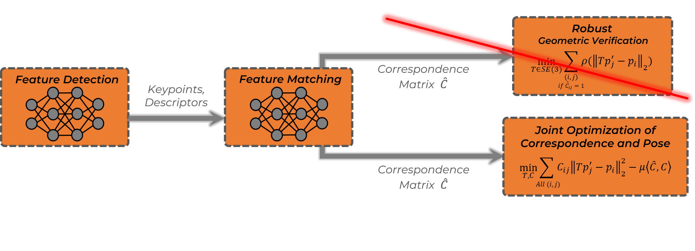
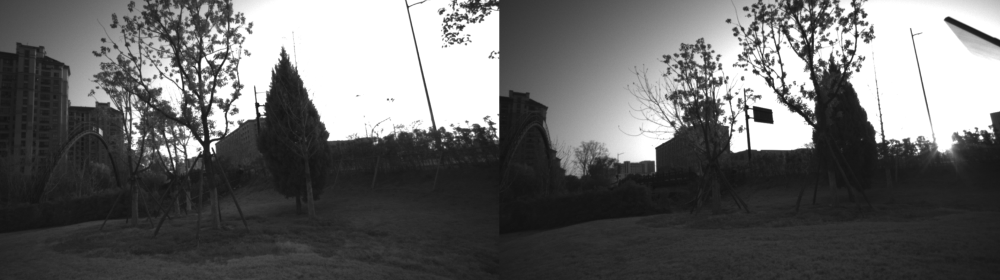
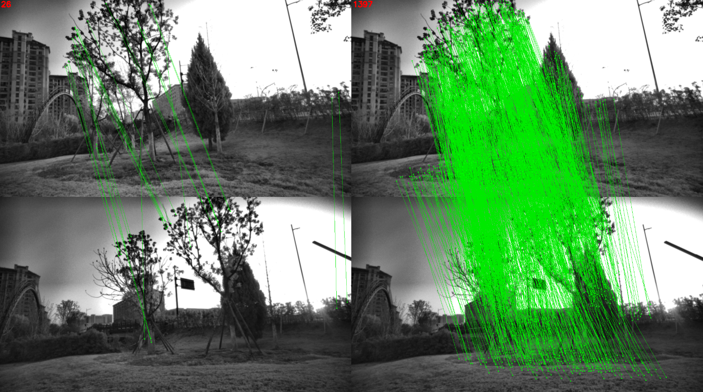
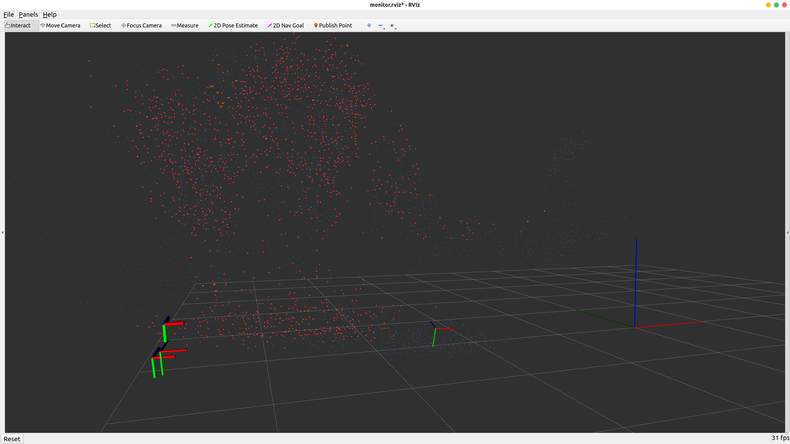

# Overview

This repository contains an implementation of a new attempt to solve the **dual-view position estimation problem**. Classically, the problem is solved by first extracting and matching features followed by outlier elimination and pose estimation using geometric verification methods. We try to break the information bottleneck in this pipeline by optimizing feature correspondences and pose jointly in a unified optimization problem.



# Quick Start

## Dependencies

Feature matching requires a Python virtual environment with [the hierarchical localization toolbox](https://github.com/cvg/Hierarchical-Localization) installed. Correspondence and pose optimization and benchmarks are tested in the following C++ environment:

- [ROS Noetic](https://wiki.ros.org/noetic/Installation/Ubuntu), [Google Logging Library](https://google.github.io/glog/stable/logging/):

  ```sh
  sudo apt install libgoogle-glog-dev
  ```

- [OpenCV](https://docs.opencv.org/4.4.0/d7/d9f/tutorial_linux_install.html) (≥ 4.4, where SIFT is supported).

- We use the RANSAC implementation in [OpenGV](https://laurentkneip.github.io/opengv).

- We use the GNC implementation in the following version of [GTSAM](https://github.com/borglab/gtsam):

  ```sh
  git clone git@github.com:borglab/gtsam.git
  git checkout f19138
  cmake .. -DGTSAM_USE_SYSTEM_EIGEN=yes && make
  ```

- We solve the joint optimization of correspondence and pose using [Gurobi](https://support.gurobi.com/hc/en-us/articles/4534161999889-How-do-I-install-Gurobi-Optimizer) (10.0.2) and [Ceres](https://github.com/ceres-solver/ceres-solver) (2.1.0).

#### Compilation

The code is released as a ROS package, please run the following command in a ROS workspace to compile it:

```sh
catkin_make -DCMAKE_BUILD_TYPE=Release -DCMAKE_EXPORT_COMPILE_COMMANDS=Yes
```

## Run a Demo

To run the released demo, run the following commands in a terminal:

```sh
source devel/setup.zsh
roslaunch rpe online_rpe.launch
```

In another terminal where the prepared Python virtual environment is activated, run the feature matching server:

```sh
python src/rpe/python/matching_server.py --feature_extraction_conf disk --matching_conf disk+lightglue
```

For 3D visualization:

```sh
rviz -d src/rpe/config/monitor.rviz
```

Then play [the demo bag](https://drive.google.com/file/d/1B5KqBfkrxqEi7nW6hPSkDBkwwEq19Zzr):

```sh
rosbag play -l demo.bag
```

After receiving images, the `online_rpe_node` enters the `INIT` state and a frame selection window will pop up, where you can select the first frame in the dual-view pose estimation by typing `Space` in the terminal, which will transfer the `online_rpe_node` to the `SOLVING_BY_TRIGGER` state. In this state, you can select the second frame of the dual-view pose estimation by typing `t` in the terminal and trigger the pose solution.



After the joint optimization of correspondence and pose is completed, you can see the difference between the feature correspondences before and after the optimization in the pop-up window, as well as the 3D results of different methods in RViz.





# Licence

The source code is released under [GPLv3](http://www.gnu.org/licenses/) license.

# Maintaince

We are still working on extending the proposed system and improving code reliability. 

For any technical issues, please contact Yunfeng Li (yunfengli@zju.edu.cn).

For commercial inquiries, please contact Fei GAO (fgaoaa@zju.edu.cn).